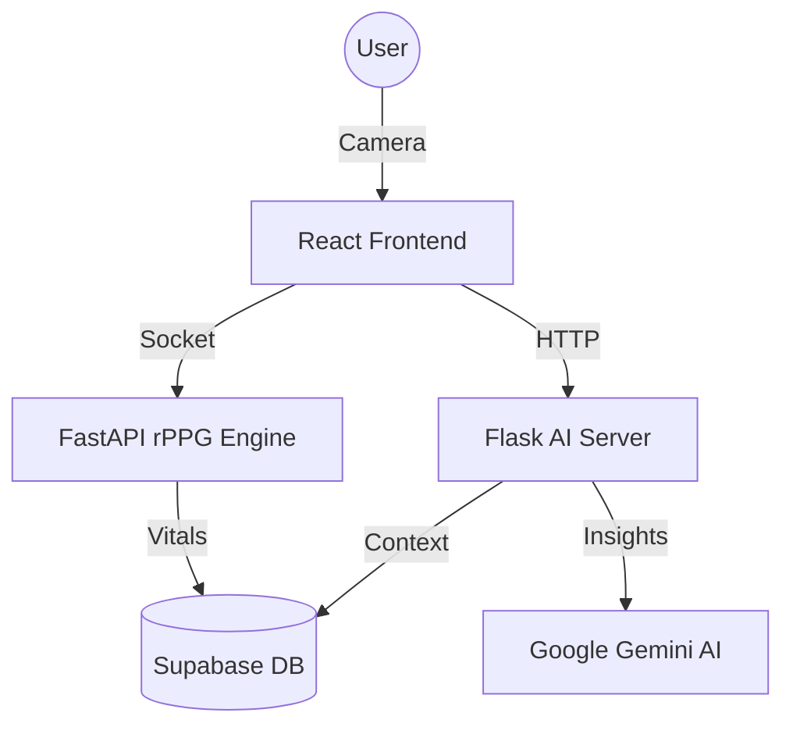

# MindPulse: AI-Driven Health & Mental Wellness Assistant

**MindPulse** is a cutting-edge health monitoring system designed for hackathon excellence. It leverages Remote Photoplethysmography (rPPG) and Generative AI to provide users with real-time physiological insights and empathetic mental health support.

## 🚀 Problem Statement
Traditional health monitoring requires physical sensors, which are often intrusive or unavailable. Furthermore, physiological data is rarely connected to conversational AI that can provide immediate, context-aware support in times of mental stress or crisis.

## 🛠️ Solution Overview
MindPulse bridge this gap by:
1. **Non-Contact Vitals**: Using a standard webcam, our rPPG engine extracts heart rate, SpO2, and HRV by analyzing micro-color changes in face pixels.
2. **Contextual AI**: An LLM-powered assistant (Gemini) that knows your latest vitals. If your stress is high, the AI knows before you even speak.
3. **Safety First**: A multi-layered crisis detection system that identifies high-risk keywords and immediately triggers emergency protocols.
4. **Seamless Integration**: A full-stack solution with real-time data persistence via Supabase.

## 🏗️ Architecture


## 💻 Tech Stack
- **Frontend**: React, Tailwind CSS, Lucide Icons, Recharts
- **Backend**: FastAPI (Biometrics), Flask (AI Services)
- **Database**: Supabase (PostgreSQL)
- **AI/ML**: MediaPipe, Google Generative AI (Gemini), NumPy, SciPy
- **Authentication**: Supabase Auth

## 🏁 Getting Started

### Prerequisites
- Python 3.9+
- Node.js 18+
- [Supabase Account](https://supabase.com/)
- [Google AI Studio API Key](https://aistudio.google.com/)

### Setup Instructions
1. **Clone the repository**:
   ```bash
   git clone https://github.com/your-repo/mindpulse.git
   cd mindpulse
   ```
2. **Configure Environment**:
   - Copy `.env.example` to `backend/.env` and `frontend/.env` (if needed).
   - Fill in your API keys.
3. **Install Dependencies**:
   ```bash
   # Backend
   pip install -r requirements.txt
   # Frontend
   cd frontend && npm install
   ```
4. **Run the Project**:
   ```bash
   # Use our helper script
   ./scripts/run_project.sh
   ```

## 🎥 Demo
Check out our [Demo documentation](docs/demo.md) for a full walkthrough of features.

## 📄 License
This project is licensed under the MIT License - see the [LICENSE](LICENSE) file for details.